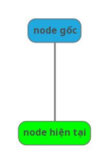
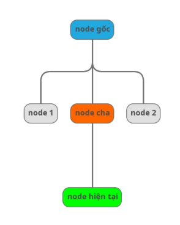
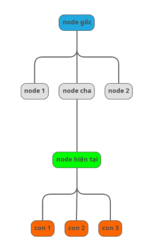
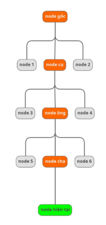
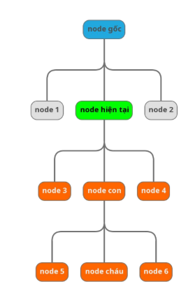
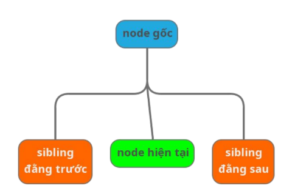
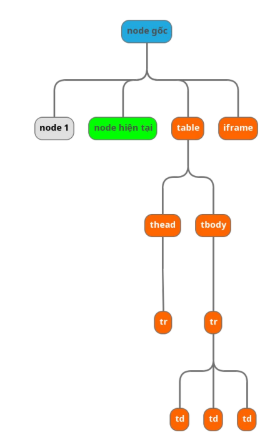
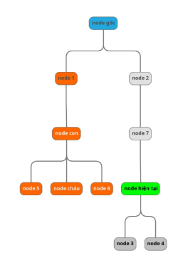

# Lesson 07 -- Selector Advanced

## 1. Tổng quan

- Chủ đề chính của Lesson 7 tập trung vào:
  - **Quan hệ giữa các node trong DOM (DOM Relationship)**
  - **XPath nâng cao (Advanced XPath Methods & Axes)**

## 2. DOM -- Mối quan hệ (Relationships)

DOM (Document Object Model) là cấu trúc dạng **cây phân cấp**, trong
đó:

- Mỗi phần tử (HTML tag) là **một node**.
- Các node có thể có **cha
  (parent)**, **con (children)**, **anh em (siblings)**, hoặc **tổ
  tiên/hậu duệ (ancestor/descendant)**.

### Các loại quan hệ trong DOM:

**Self**: Node hiện tại.



**Parent**: node phía trên trực tiếp
của node hiện tại.



**Children**: Là node phía dưới trực tiếp
của node hiện tại. Trong hình là các node: con1, con2, con3.



**Ancestor**: Tổ tiên.



**Descendant**: Hậu duệ là các node con, cháu,...



**Sibling**: Anh em, là các phần tử cùng cấp, cùng cha.



**Following**: Theo sau Gồm các node ở phía bên tay phải của node hiện tại. Không lấy những thằng con của node hiện tại.



**Preceding**: Phía trước Gồm các node ở phía bên tay trái của node hiện tại. Trừ các node ancestor.



**Ghi nhớ:**

- `following` và `preceding` **không bao gồm** node cha/con.
- `following-sibling` và `preceding-sibling` chỉ lấy các phần tử cùng cấp.

## 3. XPath -- Advanced Methods

Các phương thức nâng cao trong XPath giúp định vị phần tử chính xác hơn,
đặc biệt trong các cấu trúc DOM phức tạp.

### 1. **Wildcard `*`**

- Dùng để đại diện cho **mọi tag name**.

  ```xpath
  //*[@id='username']
  ```

### 2. **Chứa thuộc tính**

- Tìm phần tử có **attribute chứa một giá trị cụ thể**.

  ```xpath
  //input[@type='text']
  //button[@class='btn-primary']
  ```

### 3. **Logic `and` / `or`**

- Kết hợp nhiều điều kiện trong cùng một XPath.

  ```xpath
  //input[@type='text' and @name='email']
  //div[@id='main' or @class='container']
  ```

### 4. **innerText: `text()`**

- Lấy hoặc so sánh giá trị text trong thẻ.

  ```xpath
  //h1[text()='Welcome']
  ```

### 5. **normalize-space()**

- Dùng để **loại bỏ khoảng trắng thừa** (ở đầu, cuối hoặc giữa chuỗi).

  ```xpath
  //button[normalize-space()='Submit']
  ```

### 6. **contains()**

- Dùng khi **chỉ cần khớp một phần của text hoặc attribute**.

  ```xpath
  //div[contains(text(), 'Hello')]
  //a[contains(@href, 'login')]
  ```

### 7. **starts-with()**

- Dùng khi giá trị cần tìm **bắt đầu bằng một chuỗi cụ thể**.

  ```xpath
  //input[starts-with(@id, 'user')]
  ```

### 8. **not()**

- Loại trừ phần tử không thoả điều kiện.

  ```xpath
  //input[not(@disabled)]
  ```

## 4. XPath -- Axes (Trục quan hệ)

Axes giúp **di chuyển** giữa các node trong DOM dựa trên mối quan hệ của
chúng.

Cú pháp tổng quát:

```xpath
//tag/relationship::tagname[@attribute='value']
```

- **Parent**: Lấy node cha. `//input/parent::div`

- **child**: Lấy node con trực tiếp. `//div/child::input`

- **ancestor**: Lấy toàn bộ tổ tiên. `//input/ancestor::form`

- **descendant**: Lấy toàn bộ con cháu. `//form/descendant::input`

- **following**: Lấy node nằm sau node hiện tại. `//h2/following::p`

- **following-sibling**: Lấy node anh em phía sau. `//h2/following-sibling::div`

- **preceding-sibling**: Lấy node anh em phía trước. `//div/preceding-sibling::h2`

**Tip thực tế:** Dùng `ancestor::`, `descendant::`, `following-sibling::` cực kỳ hữu ích trong test automation khi phần tử không có ID/class cố định.

## 5. Tổng kết kiến thức bổ sung

- **Hiểu rõ cấu trúc DOM** là nền tảng để viết XPath chính xác.
- **Axes** cho phép "du hành" qua DOM, rất mạnh trong các case khó (ví
  dụ: input không có label).
- **normalize-space()**, **contains()**, **starts-with()**, **not()**
  là các hàm **bắt buộc phải nhớ** khi viết XPath automation test thực
  tế.
